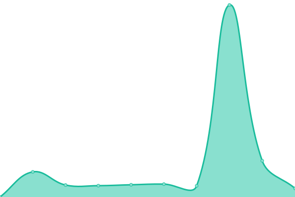
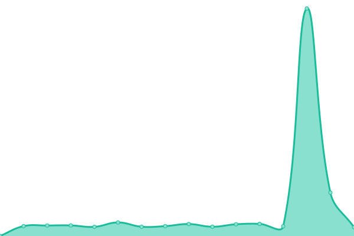
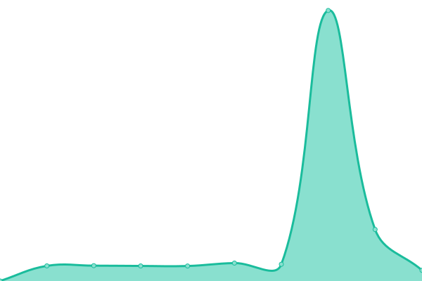
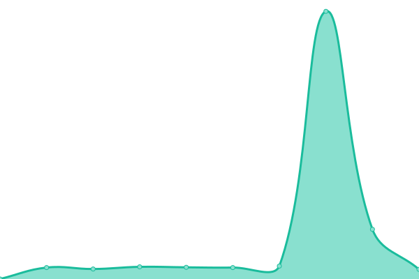
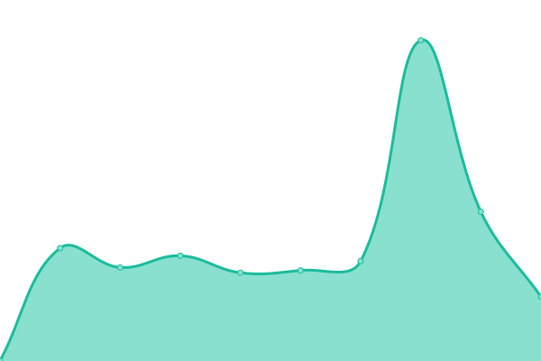
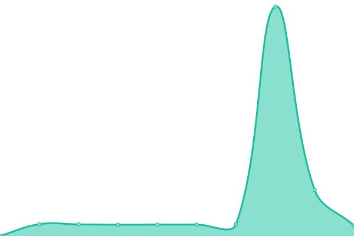
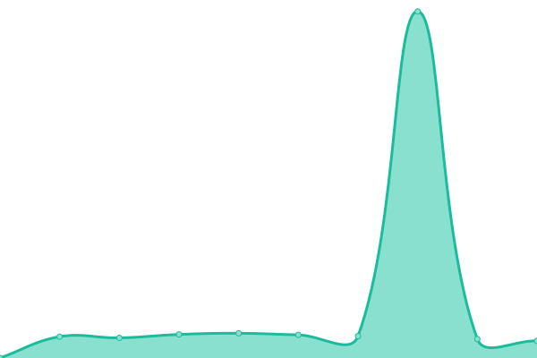

# [📈 Live Status](https://uptime.ccns.io): <!--live status--> **🟧 Partial outage**

This repository contains the open-source uptime monitor and status page for [CCNS](https://uptime.ccns.io), powered by [Upptime](https://github.com/upptime/upptime).

With [Upptime](https://upptime.js.org), you can get your own unlimited and free uptime monitor and status page, powered entirely by a GitHub repository. We use [Issues](https://github.com/ccns/upptime/issues) as incident reports, [Actions](https://github.com/ccns/upptime/actions) as uptime monitors, and [Pages](https://uptime.ccns.io) for the status page.

<!--start: status pages-->
<!-- This summary is generated by Upptime (https://github.com/upptime/upptime) -->
<!-- Do not edit this manually, your changes will be overwritten -->
<!-- prettier-ignore -->
| URL | Status | History | Response Time | Uptime |
| --- | ------ | ------- | ------------- | ------ |
|  [2019-Fall-CTF](https://2019fall.ctf.ccns.io) | 🟥 Down | [2019-fall-ctf.yml](https://github.com/ccns/upptime/commits/HEAD/history/2019-fall-ctf.yml) | 

 3938ms
     
 | 

<a href="https://uptime.ccns.io/history/2019-fall-ctf">14.92%</a>
    

|  [Alpine Linux Mirror](https://alpine.ccns.ncku.edu.tw/alpine) | 🟩 Up | [alpine-linux-mirror.yml](https://github.com/ccns/upptime/commits/HEAD/history/alpine-linux-mirror.yml) | 

 2069ms
     
 | 

<a href="https://uptime.ccns.io/history/alpine-linux-mirror">100.00%</a>
    

|  [CentOS Linux Mirror](https://centos.ccns.ncku.edu.tw/CentOS) | 🟥 Down | [cent-os-linux-mirror.yml](https://github.com/ccns/upptime/commits/HEAD/history/cent-os-linux-mirror.yml) | 

 1415ms
     
 | 

<a href="https://uptime.ccns.io/history/cent-os-linux-mirror">5.45%</a>
    

|  [Debian Linux Mirror](https://debian.ccns.ncku.edu.tw/debian) | 🟩 Up | [debian-linux-mirror.yml](https://github.com/ccns/upptime/commits/HEAD/history/debian-linux-mirror.yml) | 

 1376ms
     
 | 

<a href="https://uptime.ccns.io/history/debian-linux-mirror">100.00%</a>
    

|  [Discord Invitation](https://discord.ccns.io) | 🟩 Up | [discord-invitation.yml](https://github.com/ccns/upptime/commits/HEAD/history/discord-invitation.yml) | 

 1191ms
     
 | 

<a href="https://uptime.ccns.io/history/discord-invitation">100.00%</a>
    

|  Grafana | 🟩 Up | [grafana.yml](https://github.com/ccns/upptime/commits/HEAD/history/grafana.yml) | 

 1194ms
     
 | 

<a href="https://uptime.ccns.io/history/grafana">100.00%</a>
    

|  CCNS IPAM | 🟩 Up | [ccns-ipam.yml](https://github.com/ccns/upptime/commits/HEAD/history/ccns-ipam.yml) | 

 1137ms
     
 | 

<a href="https://uptime.ccns.io/history/ccns-ipam">100.00%</a>
    

|  [CCNS Jupyter](https://jupyter.ccns.io) | 🟥 Down | [ccns-jupyter.yml](https://github.com/ccns/upptime/commits/HEAD/history/ccns-jupyter.yml) | 

 3910ms
     
 | 

<a href="https://uptime.ccns.io/history/ccns-jupyter">21.56%</a>
    

|  CCNS Kubernetes | 🟩 Up | [ccns-kubernetes.yml](https://github.com/ccns/upptime/commits/HEAD/history/ccns-kubernetes.yml) | 

 792ms
     
 | 

<a href="https://uptime.ccns.io/history/ccns-kubernetes">100.00%</a>
    

|  [CCNS Event Leaderboard](http://leaderboard.ccns.ncku.edu.tw) | 🟥 Down | [ccns-event-leaderboard.yml](https://github.com/ccns/upptime/commits/HEAD/history/ccns-event-leaderboard.yml) | 

 0ms
     
 | 

<a href="https://uptime.ccns.io/history/ccns-event-leaderboard">10.30%</a>
    

|  CCNS LibreNMS | 🟩 Up | [ccns-libre-nms.yml](https://github.com/ccns/upptime/commits/HEAD/history/ccns-libre-nms.yml) | 

 1047ms
     
 | 

<a href="https://uptime.ccns.io/history/ccns-libre-nms">100.00%</a>
    

|  [CCNS Minecraft Map](https://mc-map.ccns.io) | 🟩 Up | [ccns-minecraft-map.yml](https://github.com/ccns/upptime/commits/HEAD/history/ccns-minecraft-map.yml) | 

 940ms
     
 | 

<a href="https://uptime.ccns.io/history/ccns-minecraft-map">100.00%</a>
    

|  CCNS CodiMD | 🟩 Up | [ccns-codi-md.yml](https://github.com/ccns/upptime/commits/HEAD/history/ccns-codi-md.yml) | 

 1105ms
     
 | 

<a href="https://uptime.ccns.io/history/ccns-codi-md">100.00%</a>
    

|  [CCNS NAS](https://nas.ccns.io) | 🟩 Up | [ccns-nas.yml](https://github.com/ccns/upptime/commits/HEAD/history/ccns-nas.yml) | 

 1126ms
     
 | 

<a href="https://uptime.ccns.io/history/ccns-nas">100.00%</a>
    

|  CCNS Passbolt | 🟩 Up | [ccns-passbolt.yml](https://github.com/ccns/upptime/commits/HEAD/history/ccns-passbolt.yml) | 

 1051ms
     
 | 

<a href="https://uptime.ccns.io/history/ccns-passbolt">100.00%</a>
    

|  [CCNS Proxmox VE](https://pve.ccns.io) | 🟩 Up | [ccns-proxmox-ve.yml](https://github.com/ccns/upptime/commits/HEAD/history/ccns-proxmox-ve.yml) | 

 915ms
     
 | 

<a href="https://uptime.ccns.io/history/ccns-proxmox-ve">100.00%</a>
    

|  [CCNS Registry](https://registry.ccns.io) | 🟩 Up | [ccns-registry.yml](https://github.com/ccns/upptime/commits/HEAD/history/ccns-registry.yml) | 

 787ms
     
 | 

<a href="https://uptime.ccns.io/history/ccns-registry">100.00%</a>
    

|  [CCNS Smokeping Landing Page](https://smokeping.ccns.io) | 🟩 Up | [ccns-smokeping-landing-page.yml](https://github.com/ccns/upptime/commits/HEAD/history/ccns-smokeping-landing-page.yml) | 

 1090ms
     
 | 

<a href="https://uptime.ccns.io/history/ccns-smokeping-landing-page">100.00%</a>
    

|  [CCNS Smokeping TANet TNN-1](https://smokeping-tanet-tnn-1.ccns.io) | 🟩 Up | [ccns-smokeping-ta-net-tnn-1.yml](https://github.com/ccns/upptime/commits/HEAD/history/ccns-smokeping-ta-net-tnn-1.yml) | 

 1010ms
     
 | 

<a href="https://uptime.ccns.io/history/ccns-smokeping-ta-net-tnn-1">100.00%</a>
    

|  [Ubuntu Linux Mirror](https://ubuntu.ccns.ncku.edu.tw/ubuntu) | 🟩 Up | [ubuntu-linux-mirror.yml](https://github.com/ccns/upptime/commits/HEAD/history/ubuntu-linux-mirror.yml) | 

 1790ms
     
 | 

<a href="https://uptime.ccns.io/history/ubuntu-linux-mirror">100.00%</a>
    

|  CCNS UniFi Controller | 🟩 Up | [ccns-uni-fi-controller.yml](https://github.com/ccns/upptime/commits/HEAD/history/ccns-uni-fi-controller.yml) | 

 1304ms
     
 | 

<a href="https://uptime.ccns.io/history/ccns-uni-fi-controller">100.00%</a>
    

<!--end: status pages-->

[**Visit our status website →**](https://uptime.ccns.io)

## 📄 License

- Powered by: [Upptime](https://github.com/upptime/upptime)
- Code: [MIT](./LICENSE) © [CCNS](https://uptime.ccns.io)
- Data in the `./history` directory: [Open Database License](https://opendatacommons.org/licenses/odbl/1-0/)
